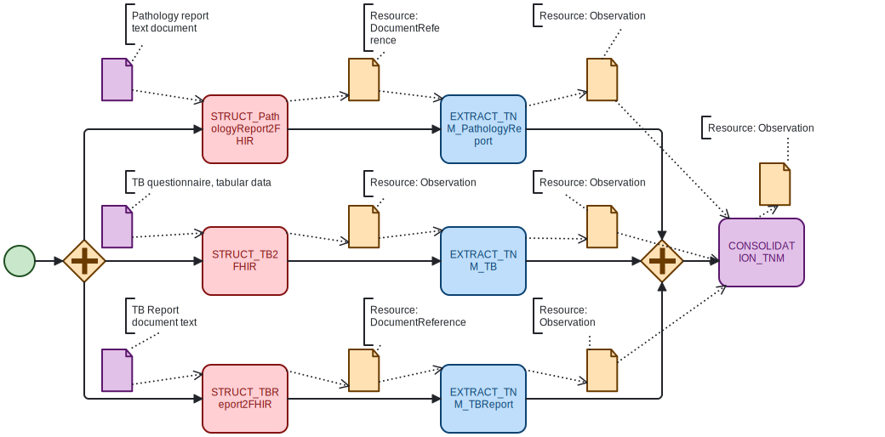

# Describing Data Processing in FHIR: AI-Assisted Interoperability

**Authors:** David OUAGNE1, Vincent ZOSSOU1, and Bastien RANCE1,2

**Affiliations:**
- 1 AP-HP, Paris, France
- 2 Centre de Recherche des Cordeliers, UMRS 1138, Université Paris Cité, Inserm, Sorbonne Université, Paris, France

**ORCID IDs:**
- David Ouagne: [0009-0001-4069-6124](https://orcid.org/0009-0001-4069-6124)
- Vincent Zossou: [0000-0001-7016-4455](https://orcid.org/0000-0001-7016-4455)
- Bastien Rance: [0000-0003-4417-1197](https://orcid.org/0000-0003-4417-1197)

---

## Summary

This study demonstrates the use of AI-assisted FHIR Implementation Guide authoring for documenting complex data transformation workflows in healthcare. Using TNM cancer staging as a use case, we explored how FHIR PlanDefinition resources can formalize the computational transformation process from raw clinical data to structured, actionable FHIR resources.

### Key Contributions

- **Novel Use of PlanDefinition:** We repurposed the FHIR PlanDefinition resource—traditionally used for care plans—to document and structure data transformation pipelines, representing sequences, dependencies, and conditions in analytical workflows.

- **Five-Category Framework:** Introduced a concise typology for organizing transformation processes: Structuration, Extraction, Normalization, Consolidation, and Derivation.

- **BPMN-to-FHIR Translation:** Developed a workflow using Business Process Model and Notation (BPMN) as a human-readable blueprint, which was then translated into formal FHIR PlanDefinition artifacts.

- **AI-Assisted Generation:** Leveraged Claude Code (Sonnet 4.5) to translate BPMN models into FHIR-compliant PlanDefinition resources in FSH format, requiring only 1-2 rounds of refinement to pass all validation controls.

### Methods

The approach involved creating BPMN diagrams to map the TNM staging workflow, documenting data sources and transformation steps, and using a structured prompting protocol to guide Claude Code in generating FHIR PlanDefinition resources. The generated artifacts were validated through syntax checking, Implementation Guide compilation, and expert review.

### Results & Impact

This work illustrates that AI can effectively translate conceptual models into formal FHIR structures, simplifying artifact generation, reducing costs in time and expertise, and assisting non-experts in adopting FHIR. The approach demonstrates how Generative AI can serve as a collaborative assistant in achieving transparent, reproducible, and semantically rich data transformation pipelines.

#### BPMN used to represent the data extraction and integration workflow
**[TNM BPMN file](./TNM.bpmn)**

---

## FHIR Implementation Guide

The complete FHIR Implementation Guide with the generated PlanDefinition for TNM Cancer Staging is available at:

**[CARPEM Oncology Staging PlanDefinition](https://interop.aphp.fr/ig/fhir/carpem/PlanDefinition-CarpemOncologyStaging.html)**

---

## Claude Code Prompt

The complete Claude Code Prompt used to generate the PlanDefinition artifact is available at:

**[Claude Code Prompt](./BPMNToPlanDefinition.md)**
---

## The resulting PlanDefinition

The resulting PlanDefinition artifact (as a FHIR FSH file) is available at:

**[TNM PlanDefinition Fsh file](./TNMPlanDefinition.fsh)**
---

## Reproductibility study

We produce five versions of the PlanDefinition using the identical context and prompt. The files are available in the **[repro_study](./repro_study/)** folder. The full analysis of the differences among the five PlanDefinition versions is available at: **[Reproducibility study](./ReproductibilityStudy.md)**

## Contact

For more information or to cite this work, please contact:
**David Ouagne:** [david.ouagne@aphp.fr](mailto:david.ouagne@aphp.fr)
